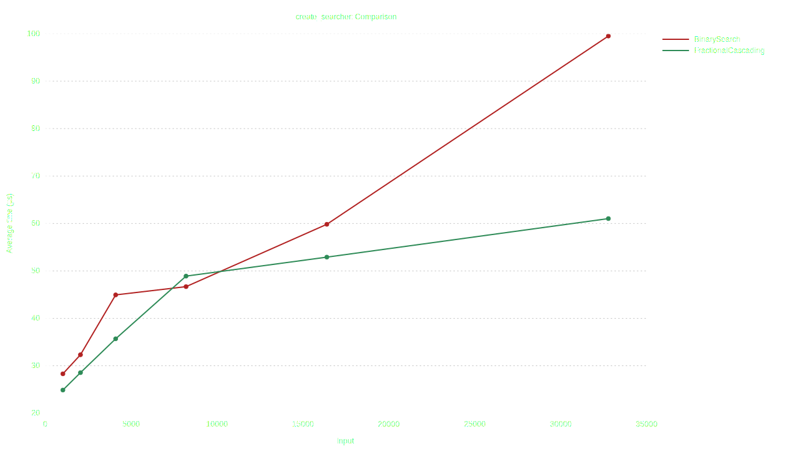

# Implementation of Fractional Cascading DS

### Benchmarks
OS: Ubuntu 22.04.2 LTS x86_64 
CPU: AMD Ryzen 5 4600H with Radeon Graphics (12) @ 3.000GHz 

### Based on:
* [`wikipedia`](https://en.wikipedia.org/wiki/Fractional_cascading)
* [`neerc wiki`](https://neerc.ifmo.ru/wiki/index.php?title=%D0%A2%D0%B5%D1%85%D0%BD%D0%B8%D0%BA%D0%B0_%D1%87%D0%B0%D1%81%D1%82%D0%B8%D1%87%D0%BD%D0%BE%D0%B3%D0%BE_%D0%BA%D0%B0%D1%81%D0%BA%D0%B0%D0%B4%D0%B8%D1%80%D0%BE%D0%B2%D0%B0%D0%BD%D0%B8%D1%8F)